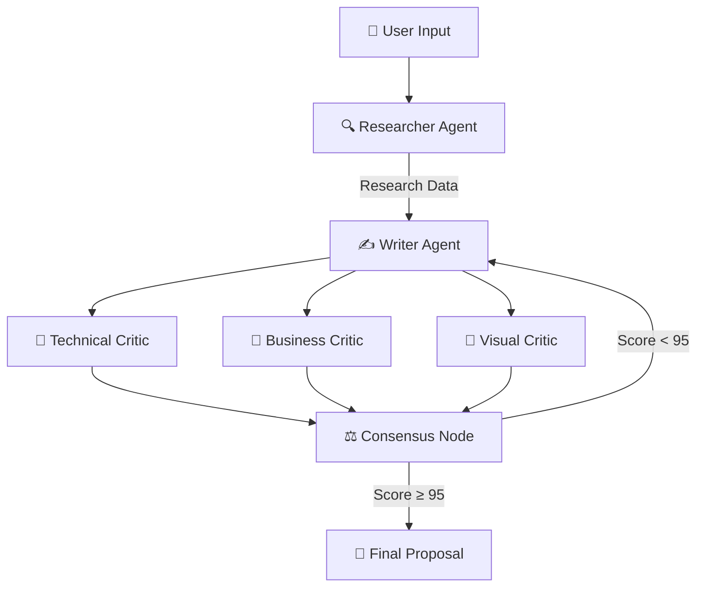

# proposal-ai-agent
AI-powered proposal generator using LangGraph
# 🤖 Proposal AI Agent
### سیستم چندعاملی هوشمند برای تولید خودکار پروپوزال تکنیکال

<div dir="rtl">

یک سیستم هوش مصنوعی پیشرفته که با استفاده از **LangGraph** و معماری Multi-Agent، به صورت کاملاً خودکار پروپوزال‌های تکنیکال با کیفیت بالا تولید می‌کند. سیستم تا زمانی که امتیاز پروپوزال به **۹۵ از ۱۰۰** برسد، به بهبود و بازنویسی ادامه می‌دهد.

---

## ✨ ویژگی‌ها

- 🔍 **جستجوی خودکار وب** — Agent محقق با DuckDuckGo اطلاعات به‌روز جمع‌آوری می‌کند
- ✍️ **تولید پروپوزال حرفه‌ای** — شامل جداول Markdown و نمودارهای Mermaid.js
- 🧠 **سه منتقد مستقل** — ارزیابی از زوایای فنی، تجاری، و بصری به‌صورت موازی
- 🔄 **حلقه بازخورد هوشمند** — بازنویسی خودکار تا رسیدن به کیفیت مطلوب
- 📄 **ذخیره خودکار** — خروجی نهایی در فایل Markdown ذخیره می‌شود

---

## 🏗️ معماری سیستم



---

## 🤖 Agent‌ها

| Agent | نقش | وظیفه |
|-------|-----|--------|
| 🔍 **Researcher** | محقق | جستجوی وب و جمع‌آوری اطلاعات فنی |
| ✍️ **Writer** | نویسنده | تولید پروپوزال با جداول و نمودار |
| 🔬 **Technical Critic** | منتقد فنی | بررسی پایه‌های ریاضی و معماری |
| 💼 **Business Critic** | منتقد تجاری | ارزیابی timeline و ارزش پروژه |
| 🎨 **Visual Critic** | منتقد بصری | بررسی نمودارهای Mermaid و جداول |
| ⚖️ **Consensus Node** | اجماع | میانگین‌گیری از نمرات سه منتقد |

---

## 🛠️ تکنولوژی‌ها


- **LangGraph** — مدیریت گراف Agent‌ها و حلقه‌های شرطی
- **LangChain** — پرامپت‌ها و زنجیره‌های LLM
- **DuckDuckGo Search** — جستجوی وب بدون نیاز به API Key
- **ChatOpenAI** — مدل زبانی اصلی (سازگار با OpenAI-compatible APIs)

---

## 🚀 نصب و راه‌اندازی

### ۱. کلون کردن مخزن
```bash
git clone https://github.com/YOUR_USERNAME/proposal-ai-agent.git
cd proposal-ai-agent
```

### ۲. نصب کتابخانه‌ها
```bash
pip install -r requirements.txt
```

### ۳. تنظیم متغیرهای محیطی
یک فایل `.env` در ریشه پروژه بساز:
```env
OPENAI_API_KEY=your_api_key_here
OPENAI_BASE_URL=your_api_base_url
OPENAI_MODEL=your_model_name
```

### ۴. اجرا
```bash
jupyter notebook Proposal_project.ipynb
```

---

## 📋 نحوه استفاده

۱. سیستم از شما می‌خواهد موضوع پروژه را وارد کنید
۲. Agent محقق اطلاعات مرتبط را از وب جمع‌آوری می‌کند
۳. Agent نویسنده اولین پیش‌نویس را تولید می‌کند
۴. سه منتقد به‌صورت موازی پیش‌نویس را ارزیابی می‌کنند
۵. در صورت امتیاز زیر ۹۵، چرخه بازنویسی آغاز می‌شود (حداکثر ۴ بار)
۶. پروپوزال نهایی در فایل `dynamic_proposal.md` ذخیره می‌شود

---

## 📁 ساختار پروژه

```
proposal-ai-agent/
│
├── Proposal_project.ipynb   # کد اصلی پروژه
├── proposal_guide.txt        # راهنمای سبک نگارش (اختیاری)
├── requirements.txt          # کتابخانه‌های مورد نیاز
├── .env                      # متغیرهای محیطی (در گیت نیست)
├── .gitignore
└── README.md
```

---

## ⚙️ تنظیمات

| پارامتر | پیش‌فرض | توضیح |
|---------|---------|-------|
| `temperature` | `0.7` | خلاقیت مدل (۰ تا ۱) |
| `max_revisions` | `4` | حداکثر دور بازنویسی |
| `target_score` | `95` | امتیاز هدف برای توقف |

---

## 📄 لایسنس

MIT License — آزاد برای استفاده و توسعه

</div>
